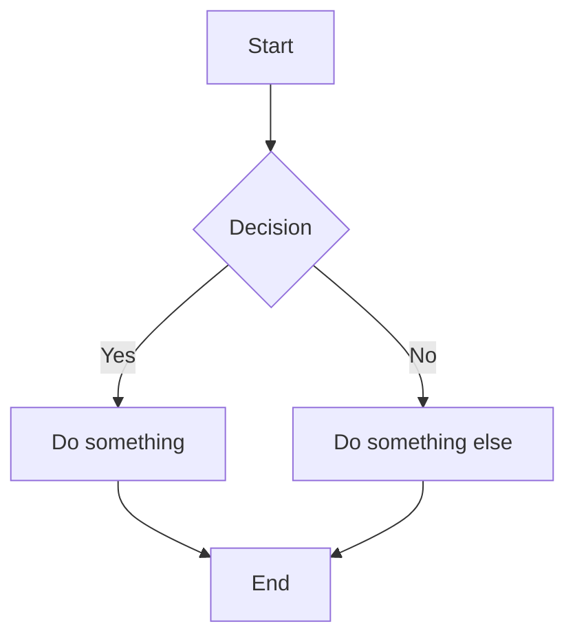

# Heading 1

글 본문 안에서 사용할 수 있는 가장 큰 제목입니다. 상세 페이지의 실제 제목은 상단 메타 영역에 따로 있으므로, 실제 글에서는 보통 `##`부터 시작해도 충분합니다.

## Heading 2

섹션을 나눌 때 가장 자주 쓰는 제목입니다.

### Heading 3

조금 더 작은 단위의 제목입니다.

#### Heading 4

세부 항목을 묶을 때 사용할 수 있습니다.

##### Heading 5

짧은 보조 제목이 필요할 때 사용할 수 있습니다.

###### Heading 6

가장 작은 제목입니다.

---

## Paragraphs and Inline Formatting

Paragraph text. This is a normal paragraph with **bold**, _italic_, **_bold italic_**, ~~strikethrough~~, `inline code`, and a [link](https://example.com).

Line break example:  
This line starts after a hard line break.

Escaped Markdown: \*not italic\*, \# not a heading, and \[not a link\](https://example.com).

Nested formatting: **bold with _italic_ inside**, _italic with **bold** inside_, and ~~strikethrough with **bold** and `code` inside~~.

---

## Blockquotes

> This is a blockquote.
>
> It can span multiple paragraphs.
>
> > This is a nested blockquote.

> ### Blockquote Heading
>
> - Quoted list item
> - Another quoted list item
>
> ```ts
> const message = 'Code inside a blockquote';
> ```

---

## Lists

### Unordered List

- Item 1
- Item 2
  - Nested item 2-1
  - Nested item 2-2
- Item 3

### Ordered List

1. First item
2. Second item
   1. Nested first item
   2. Nested second item
3. Third item

### Task List

- [x] Completed task
- [ ] Incomplete task
- [ ] Another task

### Mixed Content

1. Ordered item with a paragraph.

   This paragraph belongs to the first ordered item.

2. Ordered item with code.

   ```bash
   npm install
   npm run dev
   ```

3. Ordered item with a quote.

   > Quote inside a list item.

---

## Links

[Inline link](https://example.com)

[Link with title](https://example.com 'Example Title')

Reference-style link: [OpenAI][openai]

Raw URL autolink: https://example.com

[openai]: https://openai.com 'OpenAI'

---

## Images and Figures

![Markdown image][sample-image]

<figure>
  
  <figcaption>Figure captions can be written with MDX HTML.</figcaption>
</figure>

[sample-image]: data:image/svg+xml,%3Csvg%20xmlns%3D%22http%3A%2F%2Fwww.w3.org%2F2000%2Fsvg%22%20width%3D%22960%22%20height%3D%22480%22%20viewBox%3D%220%200%20960%20480%22%3E%3Crect%20width%3D%22960%22%20height%3D%22480%22%20fill%3D%22%23f4fbfa%22%2F%3E%3Ctext%20x%3D%22480%22%20y%3D%22248%22%20text-anchor%3D%22middle%22%20font-family%3D%22Arial%22%20font-size%3D%2240%22%20font-weight%3D%22700%22%20fill%3D%22%230e8179%22%3EMarkdown%20image%3C%2Ftext%3E%3C%2Fsvg%3E 'Markdown image title'

---

## Code

Inline code: `const message = "Hello, Markdown!";`

### Fenced Code Block

```ts
type Member = {
  nickname: string;
  name: string;
  team: 'Engineering' | 'Design' | 'Product';
};

function formatMember(member: Member) {
  return `${member.nickname} / ${member.name}`;
}
```

### Indented Code Block

    const value = 42;
    console.log(value);

### Mermaid Source



---

## Tables

| Name  | Role      | Status  |
| :---- | :-------- | :------ |
| Alice | Designer  | Active  |
| Bob   | Developer | Active  |
| Carol | PM        | Pending |

### Aligned Table

| Left   | Center | Right |
| :----- | :----: | ----: |
| Apple  |  Red   | 1,000 |
| Banana | Yellow |   250 |
| Cherry |  Dark  |    75 |

---

## Footnotes

Here is a sentence with a footnote.[^1]

Another sentence with another footnote.[^note]

[^1]: This is the first footnote.

[^note]: This is a named footnote.

---

## MDX HTML

<details>
  <summary>Click to expand</summary>
  <p>Hidden content inside a details block.</p>
  <ul>
    <li>List item inside details</li>
    <li>Another item</li>
  </ul>
</details>

Press <kbd>Cmd</kbd> + <kbd>K</kbd> to open search.

Water is H<sub>2</sub>O, and x squared is x<sup>2</sup>.

This sentence includes <mark>highlighted text</mark> and an <abbr title="HyperText Markup Language">HTML</abbr> abbreviation.

<dl>
  <dt>Term 1</dt>
  <dd>Definition for term 1.</dd>
  <dt>Term 2</dt>
  <dd>Definition for term 2.</dd>
</dl>

---

## Backslash Escapes

Markdown special characters can be escaped when they should be displayed as text.

\` backtick

\* asterisk

\_ underscore

\{ \} curly braces

\[ \] square brackets

\( \) parentheses

\# hash

\+ plus

\- minus

\. dot

\! exclamation mark

\| pipe
